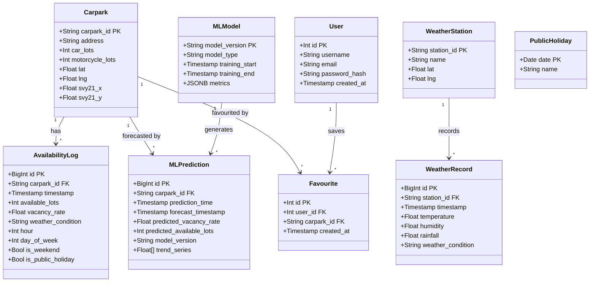

# ParkGuideSG — Class Diagram

## Entity Descriptions

| Entity | Purpose | Source |
|--------|---------|--------|
| **Carpark** | Static HDB carpark metadata (address, capacity, coordinates) | `04_bootstrap_carparks.py` from data.gov.sg |
| **AvailabilityLog** | Time-series parking availability, enriched with temporal features | `etl_cloud.py` every 30 min |
| **WeatherStation** | NEA weather station locations (47 stations) | NEA 2-hour forecast API |
| **WeatherRecord** | Timestamped weather readings per station | NEA measurement APIs |
| **User** | Registered user accounts (JWT auth, bcrypt passwords) | `/auth/register` endpoint |
| **Favourite** | User-to-carpark bookmark relationship | `/favourites` CRUD |
| **MLPrediction** | Cached vacancy predictions for the live map | `ml/train.py` + `ml/predict.py` |
| **MLModel** | Deployed model versions and training metadata | Training pipeline |
| **PublicHoliday** | Singapore public holidays for temporal features | `02_seed_holidays.sql` |

## Key Relationships

- `AvailabilityLog` → `Carpark`: Foreign key with cascade; main query path for time-series
- `MLPrediction` → `Carpark`: Cached forecasts updated after each training run
- `Favourite` → `User` + `Carpark`: Enables per-user bookmark management
- `WeatherRecord` → `WeatherStation`: Links measurements to station metadata
